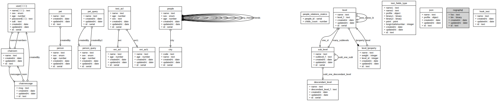

# fib-app
fibjs 应用程序基础 api 框架

## Install

```sh
npm install fib-app [--save]
```

## Test

```sh
npm test
```

## 建立基础脚本

```JavaScript
const http = require('http');
const util = require('util')
const Session = require('fib-session')
const App = require('../');

var app = new App('sqlite:test.db', {
  uuid: true
});
app.db.use(require('./defs/person'));

var session = new Session(new util.LruCache(20000), {
  timeout: 60 * 1000
});

var svr = new http.Server(8080, [
  session.cookie_filter,
  {
    '/1.0': app
  }
]);
svr.run();
```
其中 `person` 是 Model 定义模块，内容如下：
```JavaScript
module.exports = db => {
  db.define('person', {
    name: String,
    sex: ["male", "female"],
    age: Number
  });
};
```
这是一个标准的 orm 定义，同样可以使用 orm 的其它功能，比如类型检查，事件等。

## API 数据格式

对于 POST 和 PUT 请求，请求的主体必须是 JSON 格式，而且 HTTP header 的 Content-Type 需要设置为 application/json。

```sh
curl -X PUT \
  -H "Content-Type: application/json" \
  -d '{"name": "tom","sex":"male","age":23}' \
  http://localhost/1.0/person/57fbbdb0a2400000
```
对于所有的请求，响应格式都是一个 JSON 对象。

一个请求是否成功是由 HTTP 状态码标明的。一个 2XX 的状态码表示成功，而一个 4XX 表示请求失败。当一个请求失败时响应的主体仍然是一个 JSON 对象，但是总是会包含 code 和 message 这两个字段，你可以用它们来进行调试。举个例子，如果一个请求权限认证失败，会返回以下信息：
```JavaScript
{
  "code": 4030501,
  "message": "The operation isn’t allowed for clients due to class-level permissions."
}
```
code 编码分为三个部分，前三位 403 表示错误类型，05 表示数据表编号，01 表示详细错误编码。

对于 GET 请求，通常会返回对象数据，根据 GET 请求的地址不同，可能会返回一个对象，也可能会返回一个数组。比如：
```JavaScript
{
  "name": "tom",
  "sex": "male",
  "age": 23
}
```
或者：
```JavaScript
[
  {
    "name": "tom",
    "sex": "male",
    "age": 23
  },
  {
    "name": "lily",
    "sex": "female",
    "age": 22
  }
]
```
## 特殊字段
对象数据中，有四个特殊含义的字段，是不允许通过 API 更改的。分别是 `id`, `updatedAt`, `createdAt`, `createdBy`。

其中 `id`, `updatedAt`, `createdAt` 单个字段会自动创建和修改。`createdBy` 则需要自行指定类型。

## 基础对象访问 API
完成这样的数据定义，便直接拥有了一整套符合 REST api 规范的接口调用：

| url                 | method | action     |
|---------------------|--------|------------|
| /1.0/:className     | POST   | 创建新对象   |
| /1.0/:className/:id | GET    | 读取对象    |
| /1.0/:className/:id | PUT    | 修改对象    |
| /1.0/:className/:id | DELETE | 删除对象    |
| /1.0/:className     | GET    | 查询对象列表 |

### 创建新对象
为了创建一个新的对象，应该向 class 的 URL 发送一个 POST 请求，其中应该包含对象本身。例如，要创建如上所说的对象：
```sh
curl -X POST \
  -H "Content-Type: application/json" \
  -d '{"name": "tom","sex":"male","age":23}' \
  http://localhost/1.0/person
```
当创建成功时，HTTP 的返回是 201 Created，响应的主体是一个 JSON 对象，包含新的对象的 objectId 和 createdAt 时间戳：
```JavaScript
{
  "createdAt": "2017-11-25T01:39:35.931Z",
  "id": "57fbbdb0a2400000"
}
```
### 读取对象
当你创建了一个对象时，你可以通过发送一个 GET 请求到返回的 header 的 Location 以获取它的内容。例如，为了得到我们上面创建的对象：
```sh
curl -X GET http://localhost/1.0/person/57fbbdb0a2400000
```
返回的主体是一个 JSON 对象包含所有用户提供的 field 加上 `createdAt`、`updatedAt` 和 `id` 字段：
```JavaScript
{
  "name": "tom",
  "sex": "male",
  "age": 23,
  "createdAt": "2017-11-25T01:39:35.931Z",
  "updatedAt": "2017-11-25T01:39:35.931Z",
  "id": "57fbbdb0a2400000"
}
```
通过设置返回字段 `keys`，可以定制返回的内容，`keys` 的内容是一个以 `,` 分割的字段名称字符串，：
```sh
curl -X GET http://localhost/1.0/person/57fbbdb0a2400000?keys=name%2Csex
```
将返回：
```JavaScript
{
  "name": "tom",
  "sex": "male"
}
```
### 修改对象
为了更改一个对象已经有的数据，你可以发送一个 PUT 请求到对象相应的 URL 上，任何你未指定的 key 都不会更改，所以你可以只更新对象数据的一个子集。例如，我们来更改我们对象的一个 age 字段：
```sh
curl -X PUT \
  -H "Content-Type: application/json" \
  -d '{"age": 25}' \
  http://localhost/1.0/person/57fbbdb0a2400000
```
返回的 JSON 对象会包含 `updatedAt` 和 `id` 字段，表明更新发生的时间：
```JavaScript
{
  "updatedAt": "2017-11-25T01:39:35.931Z",
  "id": "57fbbdb0a2400000"
}
```
### 删除对象
为了删除一个对象，可以发送一个 DELETE 请求到指定的对象的 URL，比如：
```sh
curl -X DELETE http://localhost/1.0/person/57fbbdb0a2400000
```
### 查询对象列表
通过发送一个 GET 请求到类的 URL 上，不需要任何 URL 参数，你就可以一次获取多个对象。下面就是简单地获取所有用户：
```sh
curl -X GET http://localhost/1.0/person
```
返回的值就是一个 JSON 对象包含了 results 字段，它的值就是对象的列表：
```JavaScript
[
  {
    "name": "tom",
    "sex": "male",
    "age": 23,
    "createdAt": "2017-11-25T01:39:35.931Z",
    "updatedAt": "2017-11-25T01:39:35.931Z",
    "id": "57fbbdb0a2400000"
  },
  {
    "name": "lily",
    "sex": "female",
    "age": 22,
    "createdAt": "2017-11-25T01:39:35.931Z",
    "updatedAt": "2017-11-25T01:39:35.931Z",
    "id": "57fbbdb0a2400001"
  }
]
```
#### keys 字段定制
与对象查询一样，查询列表时可以通过设定 `keys` 来定制返回结果所包含的字段。`keys` 的内容是一个以 `,` 分割的字段名称字符串，例如：
```sh
curl -X GET http://localhost/1.0/person?keys=name%2Cage
```
将指定只返回 `name` 和 `age` 两个字段。

#### where 过滤条件
通过 `where` 参数的形式可以对查询对象做出约束。

`where` 参数的值应该是 JSON 编码过的。就是说，如果你查看真正被发出的 URL 请求，它应该是先被 JSON 编码过，然后又被 URL 编码过。最简单的使用 `where` 参数的方式就是包含应有的 key 和 value。例如，如果我们想要搜索名字为 tom 的用户，我们应该这样构造查询:
```sh
curl -X GET http://localhost/1.0/person?where=%7B%22name%22%3A%22tom%22%7D
```
`where` 的值为一个 urlencode 后的 JSON 字符串，内容为：`{"name":"tom"}`

除了完全匹配一个给定的值以外，`where` 也支持比较的方式，比如包含。`where` 参数支持如下选项：

| key          | operation | sample                |
|--------------|-----------|-----------------------|
| eq           | 等于       | {"name":{"eq":"tom"}} 或者 {"name":"tom"} |
| ne           | 不等于     | {"name":{"ne":"tom"}}   |
| gt           | 大于       | {"age":{"gt":"24"}}    |
| gte          | 大于等于    | {"age":{"gte":"24"}}    |
| lt           | 小于       | {"age":{"lt":"24"}}    |
| lte          | 小于等于    | {"age":{"lte":"24"}}    |
| like         | 模糊查询    | {"name":{"like":"%m"}}   |
| not\_like    | 模糊查询    | {"name":{"not_like":"%m"}}   |
| between      | 区间比较    | {"age":{"between":[22,25]}}   |
| not\_between | 区间比较    | {"age":{"not_between":[22,25]}}   |
| in           | 枚举       | {"name":{"in":["tom","lily"]}}   |
| not\_in      | 枚举       | {"name":{"not_in":["tom","lily"]}}   |
| or           | 或运算     | {"or":[{"name":"tom"},{"age":24}]}   |

#### skip 跳过记录
通过 `skip` 选项，可以跳过指定的记录数，达到翻页的效果。
```sh
curl -X GET http://localhost/1.0/person?skip=100
```
#### limit 返回记录限制
通过 `limit` 选项，可以限制返回记录数，`limit` 的有效数字为 1-1000，缺省为 100。
```sh
curl -X GET http://localhost/1.0/person?limit=100
```
#### order 指定排序方式
通过 `order` 选项，设定返回结果集的排序方式，字段名前包含 `-` 时为倒序。
```sh
curl -X GET http://localhost/1.0/person?order=-id
```
#### count 返回结果总数
在请求时增加 `count` 可以在返回指定内容的同时返回结果集的总数。
```sh
curl -X GET http://localhost/1.0/person?count=1&limit=1
```
此时返回结果将包含 `count` 和 `results` 两个字段，分别包含总数和结果：
```JavaScript
{
  "count": 2,
  "results": [
    {
      "name": "tom",
      "sex": "male",
      "age": 23,
      "createdAt": "2017-11-25T01:39:35.931Z",
      "updatedAt": "2017-11-25T01:39:35.931Z",
      "id": "57fbbdb0a2400000"
    }
  ]
}
```
## 建立扩展对象
通过 orm 定义 hasOne 和 hasMany，可以定义对象之间的关联关系，并在 API 上体现出来，例如：

```JavaScript
module.exports = db => {
  var Person = db.models.person;

  var Pet = db.define('pet', {
    name: String
  });

  Person.hasMany('pets', Pet);
};
```
## 扩展对象访问 API
下面是扩展对象的 API 定义：

| url                                  | method | action        |
|--------------------------------------|--------|---------------|
| /1.0/:className/:id/:extendName      | PUT    | 设置扩展对象    |
| /1.0/:className/:id/:extendName      | POST   | 创建扩展对象    |
| /1.0/:className/:id/:extendName/:rid | GET    | 读取扩展对象    |
| /1.0/:className/:id/:extendName/:rid | PUT    | 修改扩展对象    |
| /1.0/:className/:id/:extendName/:rid | DELETE | 删除扩展对象    |
| /1.0/:className/:id/:extendName      | GET    | 查询扩展对象列表 |

### 设置扩展对象
设置扩展对象是将两个独立的对象建立联系。比如 tom 领养了一只叫 cat 的宠物，可以用下面的操作实现：
```sh
curl -X PUT \
  -H "Content-Type: application/json" \
  -d '{"id": "57fbbdb0a2400007"}' \
  http://localhost/1.0/person/57fbbdb0a2400000/pets
```
在调用里需要在 body 内指定 cat 的 id。
### 创建扩展对象
直接创建扩展对象，可以在创建对象的同时，建立对象之间的联系。比如：
```sh
curl -X POST \
  -H "Content-Type: application/json" \
  -d '{"name": "cat"}' \
  http://localhost/1.0/person/57fbbdb0a2400000/pets
```
将创建一只名叫 cat 的宠物，并建立与 tom 的关联关系。

### 读取扩展对象
读取扩展对象与读取基础对象很相似，也同样支持 keys 选项：
```sh
curl -X GET http://localhost/1.0/person/57fbbdb0a2400000/pets/57fbbdb0a2400007
```
### 修改扩展对象
读取扩展对象与读取基础对象很相似：
```sh
curl -X PUT \
  -H "Content-Type: application/json" \
  -d '{"name": "cat 1"}' \
  http://localhost/1.0/person/57fbbdb0a2400000/pets/57fbbdb0a2400007
```
### 删除扩展对象
删除扩展对象不会删除对象本身，只会解除对象之间的关系：
```sh
curl -X DETELE http://localhost/1.0/person/57fbbdb0a2400000/pets/57fbbdb0a2400007
```
### 查询扩展对象列表
查询扩展对象列表与查询基础对象列表很相似，也同样支持 keys 以及条件过滤等选项：
```sh
curl -X GET http://localhost/1.0/person/57fbbdb0a2400000/pets
```

## ACL
可以通过定义 Model 的 ACL 控制数据权限。比如:
```JavaScript
const orm = require('fib-orm');

module.exports = db => {
  db.define('blog', {
    title: String,
    detail: String，
    note: String
  }, {
    ACL: function(session) {
      return {
        "*": {
          "*": false
        },
        "57fbbdb0a2400000": {
          "*": true
        },
        "roles": {
          "user": {
            "read": true
          }
        }
      };
    }
  });
};
```
如果定义 Model 时未指定 ACL，则等同于设定了缺省权限：
```JavaScript
{
  "*": {
    "*": true
  }
}
```
### 主体
ACL 主体描述有三种，用户 `id`，用户 `role` 和 `*`，`id` 表示一个具体的用户，`role` 表示具有某个角色的用户，`*` 表示所有用户：

| 主体   | 描述        | 优先级 |
|-------|-------------|-------|
| id    | 具体用户的 id | 1     |
| role  | 用户组名      | 2     |
| *     | 全体         | 3     |

在检查权限时，首先会匹配 `id` 对应的权限，如果未指定，则匹配用户 `role` 对应的权限，如果仍为指定，则查看是否指定了 `*` 的权限，如果 `*` 也未指定，则没有权限。

比如上面的权限配置，指定了 `user` 用户组可以阅读，用户 `57fbbdb0a2400000` 拥有全部权限，而其它用户没有任何权限。

### 权限
ACL 根据 API 行为将权限分类五种：

| 权限    | 描述       | 允许类型               |
|--------|------------|----------------------|
| create | 创建对象    | true / false / array |
| read   | 读取对象    | true / false / array |
| write  | 修改对象    | true / false / array |
| delete | 删除对象    | true / false         |
| find   | 查询对象列表 | true / false         |
| *      | 匹配所有权限 | true / false / array |

权限制定 `true` 为允许访问，为 `false` 为禁止访问，为 `array` 为只允许指定的字段的访问。`delete` 和 `find` 不接受 `array`，如果设置了 `array` 则视同为 `true`。如果指定的权限不存在，则匹配同主体下的 `*` 权限。若都不存在，再一次查询下一优先级的主体。

比如以上例子，如果需要设定 `user` 只允许读取 `title` 和 `detail`，其他人可以读取  `title`，则可以这样设定：

```JavaScript
{
  "*": {
    "*": false,
    "read": ['title']
  },
  "57fbbdb0a2400000": {
    "*": true
  },
  "roles": {
    "user": {
      "read": ['title', 'detail']
    }
  }
}
```

### 对象权限
在 Model 上设定的是整个类的权限，如果需要对具体的对象设定权限，可以通过设置 OACL 来实现：
```JavaScript
module.exports = db => {
  db.define('person', {
    name: String,
    sex: ["male", "female"],
    age: Number
  }, {
    ACL: function(session) {
      return {
        "*": {
          "*": false
        }
      }
    },
    OACL: function(session) {
      var _acl = {};
      if(this.id === session.id)
        _acl[session.id] = {
          "*": true
        };

      return _acl;
    }
  });
};
```
在这个例子中，当访问者是对象本人时，将被允许全部操作，否则禁止一切访问。会按照以下步骤检查权限：
* `person[57fbbdb0a2400000]` => `OACL`
* `person` => `ACL`

### 扩展对象权限
扩展对象的访问权限控制和基础对象权限相似，唯一不同的是在 ACL 需要单独指定：
```JavaScript
module.exports = db => {
  var Person = db.define('person', {
    name: String,
    sex: ["male", "female"],
    age: Number
  },{
    ACL: function(session) {
      return {
        "*": {
          "read": ['name', 'sex'],
          "extends": {
            "pets": {
              "read": true,
              "find": true
            }
          }
        }
      }
    },
    OACL: function(session) {
      var _acl = {};
      if(this.id === session.id)
        _acl[session.id] = {
          "*": true,
          "extends": {
            "pets": {
              "*": true
            }
          }
        };

      return _acl;
    }
  });

  var Pet = db.define('pet', {
    name: String
  });

  Person.hasMany('pets', Pet);
};
```
这个定义中，任何人都可以查阅个人信息的 `name` 和 `sex`，并自由查阅和搜索他的 `pets`，用户本人可以操作自己的所有数据，以及拥有自己宠物信息的全部权限。

在检查扩展对象的访问权限时，会分别检查对象权限和扩展对象权限。比如以下请求：
```sh
curl -X GET http://localhost/1.0/person/57fbbdb0a2400000/pets/57fbbdb0a2400007
```
会按照以下步骤检查权限：
* `pets[57fbbdb0a2400007]` => `OACL`
* `person[57fbbdb0a2400000]` => `OACL` => `extends` => `pets`
* `person` => `ACL` => `extends` => `pets`
* `pets` => `ACL`

## Function
可以为 Model 定义 api，对于复杂数据操作，可以通过自定义 Function 来完成。

绝大多数权限可以通过 ACL 控制完成，不需要通过 Function 来完成基于对象的权限。Function 可用于完成基于数据的权限，比如根据审批状态，赋予不同用户组权限。以及多项修改，比如需要修改多条数据库记录。

## 绘制数据模型
在完成数据定义以后，可以使用 `app.diagram()` 绘制数据模型的 `svg` 格式类图，保存至文件会得到类似下面的图像：
